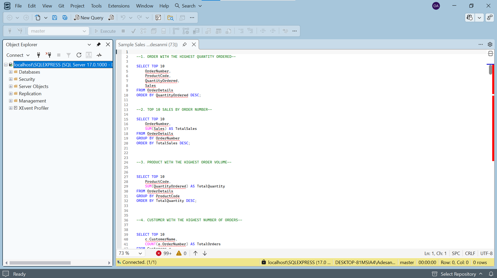

# 🛒 Sample Sales SQL Analysis

## Overview

This project explores sales performance, customer behavior, product demand, and revenue trends using SQL.

The analysis focuses on extracting meaningful business insights from transactional sales data through aggregation, filtering, sorting, and joins.

## Business Problems

The analysis answers questions such as:

- Which orders generated the highest sales?
- Which products were ordered the most?
- Which customers placed the highest number of orders?
- What products generated the most revenue?
- Which customers contributed the highest sales value?
- What are the overall sales trends within the dataset?

## Skills Demonstrated

Throughout this project, the following SQL skills were applied:

- SELECT Statements
- WHERE Clauses
- ORDER BY
- GROUP BY
- Aggregate Functions
- SUM()
- COUNT()
- AVG()
- INNER JOIN
- LEFT JOIN
- Aliasing
- Data Aggregation
- Business Analysis Using SQL

## Files Included

- Sample Sales SQL Queries.sql
- Dashboard
- README.md

## Key Insights

- Identified top-performing products by sales volume.
- Determined customers with the highest purchase activity.
- Analyzed revenue generated across orders.
- Explored sales performance patterns within the dataset.
- Generated business insights to support data-driven decision making.

## Tools Used

- SQL Server
- SQL Server Management Studio (SSMS)

## Dashboard Preview

## Author

Odunola Adewale
